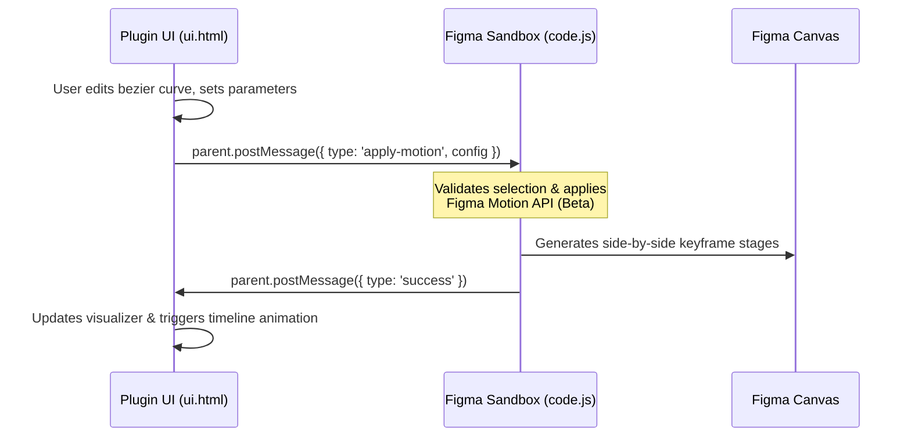

# 🎬 MotionKit Pro for Figma

**MotionKit Pro** is a professional-grade, high-fidelity motion design suite built directly into Figma. It enables designers to apply butter-smooth animation keyframes and spring physics to Figma frames, preview them with a high-fidelity timeline, and export production-ready code for developers across multiple frontend frameworks.

Running entirely as a vanilla, buildless Figma plugin, MotionKit Pro utilizes the cutting-edge (Beta) Figma Motion API with solid, graceful fallbacks to deliver instant motion feedback on your design canvas.

---

## ✨ Key Features

### 1. Twelve Professional Animation Presets
We've built 12 highly tuned, hardware-accelerated motion standards designed to feel premium and professional out of the box:
*   **Fade In:** A elegant opacity-only fade.
*   **Slide Up / Down / Left / Right:** Positional translations paired with clean opacity transitions.
*   **Pop In:** Scaling up from 0.8 to 1.0 with a subtle, modern overshoot.
*   **Scale Out:** An elegant scale-down fade-in from 1.2 to 1.0.
*   **Flip X / Y:** 3D rotational entries around the horizontal or vertical axes.
*   **Spin:** A fluid 360-degree rotational entry.
*   **Elastic Slide:** A springy positional transition that bounces dynamically.
*   **Reveal Mask:** Automatically toggles frame clipping (`clipsContent`) and expands size for a dramatic reveal.

### 2. Interactive Cubic-Bezier & Spring Editors
*   **Cubic-Bezier Editor:** Drag control handles on an SVG grid to customize easing curves. Real-time visual feedback updates as you drag.
*   **Spring Physics Visualizer:** Fine-tune `Stiffness`, `Damping`, and `Mass`. A live canvas simulation plots the spring's decaying oscillation path as you tweak values.

### 3. Custom Keyframe Builder
*   Need more control? Toggle the **Custom Keyframe Builder** to design custom trajectories.
*   Supports **5 timeline stops** (0%, 25%, 50%, 75%, 100%).
*   Independently animate, toggle, and keyframe multiple properties at each stop:
    *   `Opacity` (Fade)
    *   `X / Y Translate` (Position)
    *   `Scale` (Size)
    *   `Rotation` (Orientation)

### 4. Advanced Stagger Engine
Apply staggered animation sequences to child frames within your selection:
*   **4 Ordering Modes:** Forward, Reverse, Center-Out, and Random.
*   **Stagger Offsets:** Fine-tune delay timings per child.
*   **Full Intensity:** Child elements animate at full intensity (not diluted), creating punchy, cohesive layouts.

### 5. Multi-Framework Code Exporter
Bridging the gap between design and production code, MotionKit Pro features a live-updating, tabbed code exporter for:
*   **CSS Keyframes:** Clean, standard `@keyframes` rules.
*   **Tailwind CSS:** Ready-to-paste `tailwind.config.js` configurations.
*   **Framer Motion:** Declarative React/Next.js animation objects.
*   **GSAP:** Javascript-based GreenSock timelines.
*   **Web Animations API (WAAPI):** Pure Javascript keyframe arrays.

---

## 🛠️ Installation Guide

Because MotionKit Pro is written in pure vanilla Javascript and HTML, **no build step or package compilation is required**. You can load it instantly into Figma:

1.  **Download/Clone** this repository to your local machine.
2.  Open the **Figma Desktop App**.
3.  Go to `Plugins` -> `Development` -> `Import plugin from manifest...`
4.  Navigate to the cloned folder and select the `manifest.json` file.
5.  *That's it!* MotionKit Pro is now ready to use under your Plugins menu.

---

## 🚀 Usage Guide

1.  **Select a Frame:** Select any Top-Level Frame or Auto Layout frame on your Figma canvas.
2.  **Open the Plugin:** Run MotionKit Pro from your Figma plugins dropdown.
3.  **Choose a Motion Profile:** Select from one of the 12 presets, or configure a custom curve/spring profile.
4.  **Tune the Parameters:** Adjust `Duration`, `Stagger Delay`, or tweak custom cubic-bezier handles / spring sliders.
5.  **Live Canvas Preview:** Click **Play** or scrub the visual timeline within the plugin panel to review keyframe steps.
6.  **Apply to Selection:** Click **Apply Motion**. The plugin will generate keyframe frames side-by-side on your canvas for design review, or apply native Figma Motion configurations where supported.
7.  **Grab the Code:** Click the **Export Code** tab, select your preferred format, and click **Copy Code**.

---

## 🏗️ Architecture Overview

MotionKit Pro uses Figma's dual-thread sandboxed plugin architecture:



*   **`ui.html` (The Front-End Interface):** Runs inside an `<iframe>` container. It handles user interactions, rendering of the visual curve/spring graphs, timeline scrubbers, code formatting, and imports Google Fonts (`Outfit` and `JetBrains Mono`) for a premium visual design.
*   **`code.js` (The Controller):** Runs inside Figma's secure sandbox. It communicates with `ui.html` via standard `postMessage` handlers, reads selected Figma elements, parses animation configurations, calculates interpolation steps, and applies keyframes.

---

## 🔬 Note on Figma Motion API (Beta)

This plugin leverages beta endpoints in Figma's native API:
*   `applyManualKeyframeTrack`
*   `removeManualKeyframeTrack`
*   `setTimelineDuration`
*   `figma.motion.physicalSpringToNormalized`

MotionKit Pro includes defensive `try/catch` wrappers. If the Beta API is unavailable in your environment, the plugin gracefully falls back to generating design-level keyframe layouts directly on the canvas, ensuring no disruption to your workflow.

---

## 📂 File Structure

```bash
├── manifest.json   # Plugin definitions & API scopes
├── package.json    # Project details (v2.0.0)
├── code.js         # Plugin controller logic & layout interpolation
└── ui.html         # Premium dark theme UI, CSS layout & visual editors
```

---

## 📄 License & Credits

Developed with ❤️ for designers and developers looking for high-fidelity animations inside Figma. 

Licensed under the **ISC License**. Feel free to use, modify, and build upon this plugin!
